# Overview
[](https://github.com/ummer-shell/azure-cicd-project/actions/workflows/pythonapp.yml)

Project: Building a CI/CD Pipeline as part of the Udacity Azure Devops course. 

The base application is a house price predictor API for the Boston area  with as pre-trained `sklearn` model based on data from [Kaggle](https://www.kaggle.com/c/boston-housing). A prediction is made according to several features including average rooms, highway access, teacher-pupil ratios.

The goal of this project is to create a pipeline that can automatically build, test and deploy the web app Azure. To do this, the following tools were leveraged:
- Azure App Service
- Azure Pipeline
- Github Actions
- Locust (load testing)

In line with these goals, technical details and instructions below focus on the CI/CD pipe line rather than the predicton engine.

## Project Plan
As part of the project rubric, a fictional project plan was required and is available below:
- [Trello Board](https://trello.com/b/s2edAcH3/udacity-ci-cd-pipeline) (Note: this link will no longer be valid following successful project submission)
- [Excel Spreadsheet](https://github.com/ummer-shell/azure-cicd-project/blob/main/project-plan.xlsx)


## Architecture
The project architecture was split into two components, firstly a basic continuous integration (CI) with Github actions and secondly a full continouus delivery (CD) pipeline with Azure pipelines.

The Github actions section runs the commands in the file [pythonapp.yml](./.github/workflows/pythonapp.yml) which installs dependencies, checks the python code lint and runs a basic test. The architecture is below:

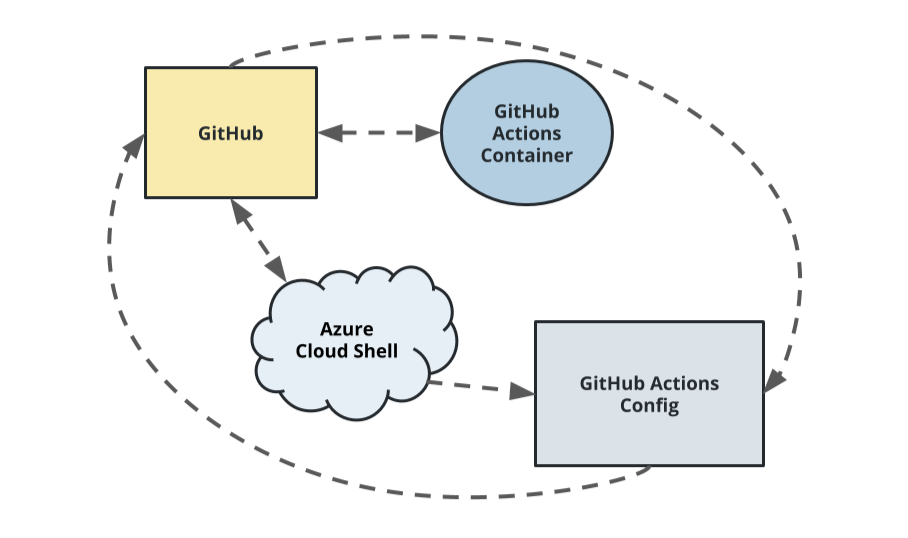
Source: Udacity Lesson Material

The Azure pipelines section runs the commands in the file [azure-pipelines-for-self-hosted-agent.yml](./azure-pipelines-for-self-hosted-agent.yml), which runs after the build is successful in github and the change event occurs. The steps include:
- Install requirements with the specific package versions supported by Azure
- Run lint tests
- Archive Files
- Upload Package
- Deploy to Azure App Service

A schematic diagram of the architecture is presented below:

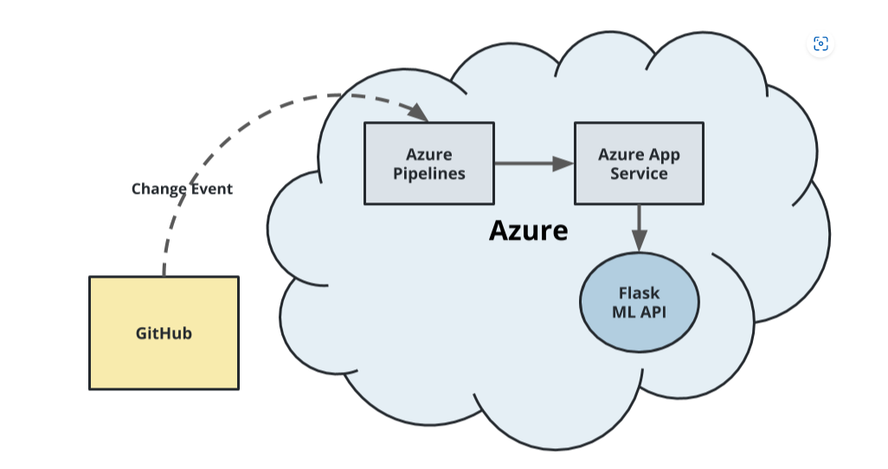
Source: Udacity Lesson Material


## Instructions
*This is also available in video form in the Demo section. In addition, all commands used are available in the [commands.sh]() file*

1. Clone the repository in your preferred environment (and also push to your own account). In this demo, the Azure cloud shell is used: 
```bash
git https://github.com/ummer-shell/azure-cicd-project.git
cd azure-cicd-project
```
Example output:
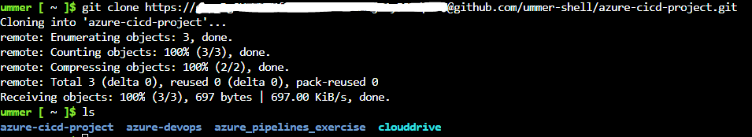

2. Create a virtual environment:
```bash
python3 -m venv ~/.cicd_project
source ~/.cicd_project/bin/activate
```

3. Test the code using the Makefile command:
```bash 
make all
```
Example output:

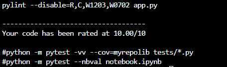

4. Deploy in the application to the Azure App Service:
```bash
# Deploy web app (note: the name must be unique globally)
az webapp up --name udacity-flask-cicd-project--resource-group azure-cicd-project
```
This runs at the following url: https://udacity-flask-cicd-project.azurewebsites.net/

Example output from the web browser:
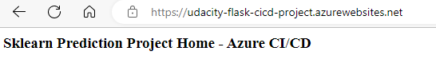

The resource group created should be available in the [Azure portal](https://portal.azure.com/) and visible as an Azure App Service:
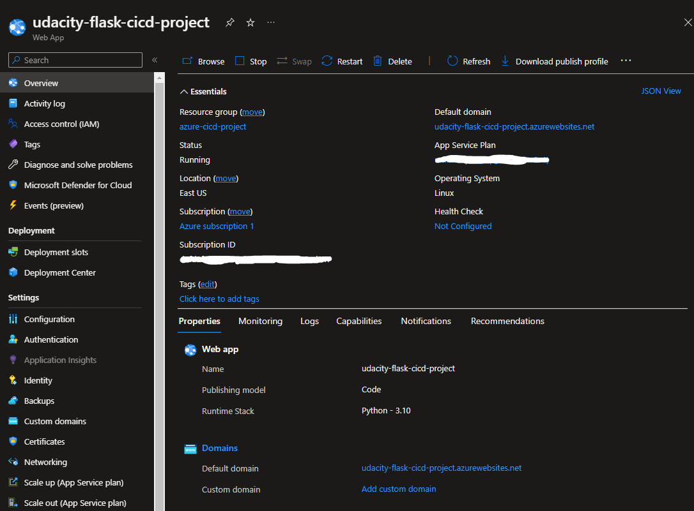

5. Test the running application by requesting prediction via the [make_predict_azure_app.sh](./make_predict_azure_app.sh) file. This runs a curl POST request to the `predict` route with sample parameter values.
```bash
chmod +x ./make_predict_azure_app.sh
./make_predict_azure_app.sh
```
Example output:
```bash
Port: 443
{"prediction":[2.431574790057212]}
```
The application log is visible through through the following command:
```bash
az webapp log tail
```

Example output:

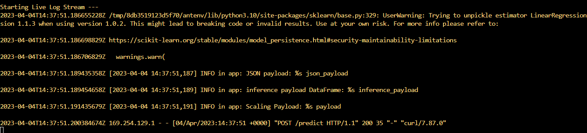

6. (Optional) Enable Github actions to set-up basic continuous integration:
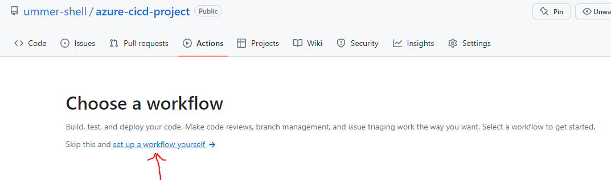
Copy/Paste the code from [pythonapp.yml](./.github/workflows/pythonapp.yml).

    Successful implementation will result in a page similar to the following under the actions tab:
    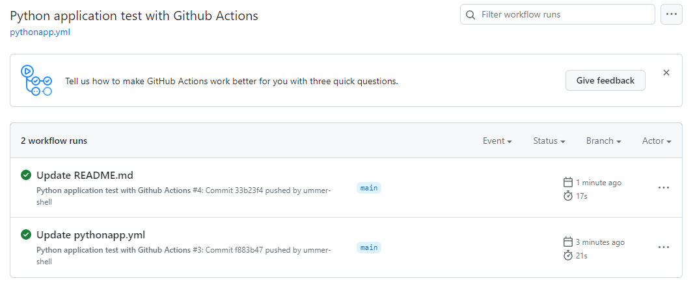

7. Set-up a devops project via the [Azure devops portal](https://dev.azure.com). Navigate to the page:
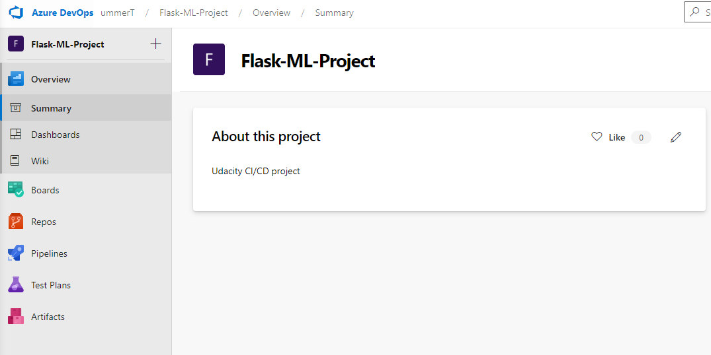

8. Set-up a service connnection to the azure app service project via projet settings

9. (Optional) If you are on the free tier of azure, you will need to set-up a Self-hosted pipeline agent. This can be done via the following tutorial
https://learn.microsoft.com/en-us/azure/devops/pipelines/agents/v2-windows?view=azure-devops 

10. Navigate to pipelines in the azure devops project, and add a new pipeline. Provide permissions to connect to your github repository and select the [azure-pipelines-for-self-hosted-agent.yml](./azure-pipelines-for-self-hosted-agent.yml).

11. Edit the file to with the required parameters as shown below:
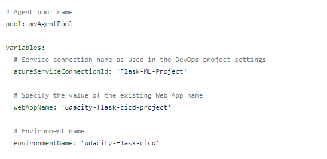

12. Create the pipeline, and the build will commence. A successful implementation of the pipeline is below. This will run each time a change is committed to github:
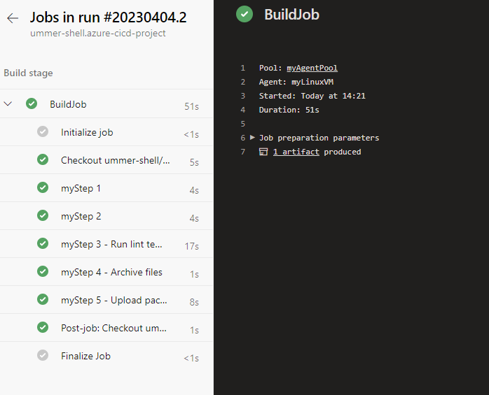

13. (Optional) The final stage is load testing the deployed application. Thhis was done via the [locust](https://docs.locust.io/en/stable/what-is-locust.html). The test was specified by the `locustfile.py` and can be run by the following command:
```bash
# Run locust tests with 100 users and 5 sec in between request
locust --host https://udacity-flask-cicd-project.azurewebsites.net/ --headless -u 100 -r 5
```

Example output:
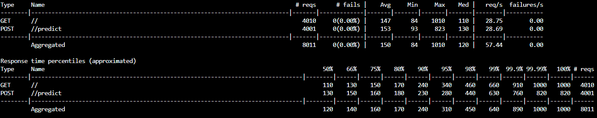

## Demo 

[](https://www.youtube.com/watch?v=YOUTUBE_VIDEO_ID_HERE)


## Enhancements
The following future enhancements could be implemented:
- Full front-end user interface (currently placeholder page)
- Load balancing
- Additional locations
- Historical prices and changes over time
