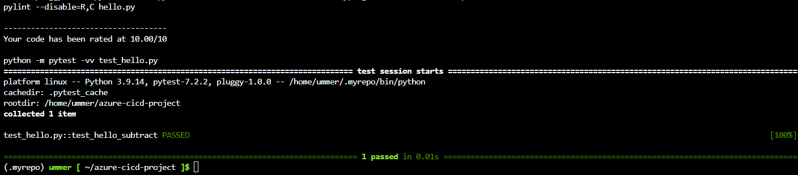

# Overview
[](https://github.com/ummer-shell/azure-cicd-project/actions/workflows/pythonapp.yml)

Project: Building a CI/CD Pipeline as part of the Udacity Azure Devops course. 

The base application is a house price predictor API for the Boston area  with as pre-trained `sklearn` model based on data from [Kaggle](https://www.kaggle.com/c/boston-housing). A prediction is made according to several features including average rooms, highway access, teacher-pupil ratios.

The goal of this project is to create a pipeline that can automatically build, test and deploy the web app Azure. To do this, the following tools were leveraged:
- Azure App Service
- Azure Pipeline
- Github Actions
- Locust (load testing)

In line with these goals, technical details and instructions below focus on the CI/CD pipe line rather than the predicton engine.

## Project Plan
As part of the project rubric, a fictional project plan was required and is available below:
- [Trello Board](https://trello.com/b/s2edAcH3/udacity-ci-cd-pipeline) (Note: this link will no longer be valid following successful project submission)
- [Excel Spreadsheet](https://github.com/ummer-shell/azure-cicd-project/blob/main/project-plan.xlsx)


## Architecture
The project architecture was split into two components, firstly a basic continuous integration (CI) with Github actions and secondly a full continouus delivery (CD) pipeline with Azure pipelines.

The Github actions section runs the commands in the file [pythonapp.yml](./.github/workflows/pythonapp.yml) which installs dependencies, checks the python code lint and runs a basic test. The architecture is below:


Source: Udacity Lesson Material

The Azure pipelines section runs the commands in the file [azure-pipelines-for-self-hosted-agent.yml](./azure-pipelines-for-self-hosted-agent.yml), which runs after the build is successful in github and the change event occurs. The steps include:
- Install requirements with the specific package versions supported by Azure
- Run lint tests
- Archive Files
- Upload Package
- Deploy to Azure App Service

A schematic diagram of the architecture is presented below:


Source: Udacity Lesson Material


## Instructions
*This is also available in video form in the Demo section. In addition, all commands used are available in the [commands.sh]() file*

1. Clone the repository in your preferred environment. In this demo, the Azure cloud shell is used: 
```bash
git https://github.com/ummer-shell/azure-cicd-project.git
cd azure-cicd-project
```
Example output:


2. Test the code using the Makefile command:
```bash 
make all
```
Example output:


2. Deploy in the application to the Azure App Service:
```bash
# Deploy web app (note: the name must be unique globally)
az webapp up --name udacity-flask-cicd-project--resource-group azure-cicd-project
```
This runs at the following url: https://udacity-flask-cicd-project.azurewebsites.net/

Example output from the web browser:


The resource group created should be available in the [Azure portal](https://portal.azure.com/) and visible as an Azure App Service:


<TODO:  Instructions for running the Python project.  How could a user with no context run this project without asking you for any help.  Include screenshots with explicit steps to create that work. Be sure to at least include the following screenshots:

* Project running on Azure App Service

* Project cloned into Azure Cloud Shell

* Passing tests that are displayed after running the `make all` command from the `Makefile`

* Output of a test run

* Successful deploy of the project in Azure Pipelines.  [Note the official documentation should be referred to and double checked as you setup CI/CD](https://docs.microsoft.com/en-us/azure/devops/pipelines/ecosystems/python-webapp?view=azure-devops).

* Running Azure App Service from Azure Pipelines automatic deployment

* Successful prediction from deployed flask app in Azure Cloud Shell.  [Use this file as a template for the deployed prediction](https://github.com/udacity/nd082-Azure-Cloud-DevOps-Starter-Code/blob/master/C2-AgileDevelopmentwithAzure/project/starter_files/flask-sklearn/make_predict_azure_app.sh).
The output should look similar to this:

```bash
udacity@Azure:~$ ./make_predict_azure_app.sh
Port: 443
{"prediction":[20.35373177134412]}
```

* Output of streamed log files from deployed application

> 

## Enhancements
The following future enhancements could be implemented:
- Full front-end user interface (currently placeholder page)
- Load balancing
- Additional locations
- Historical prices and changes over time

## Demo 

[Demo Video](https://youtube.com)
